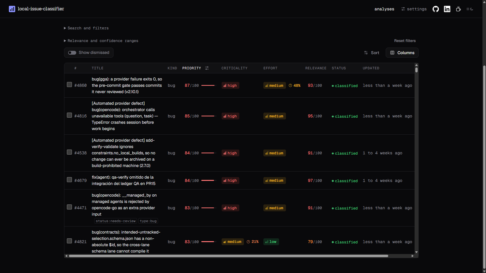
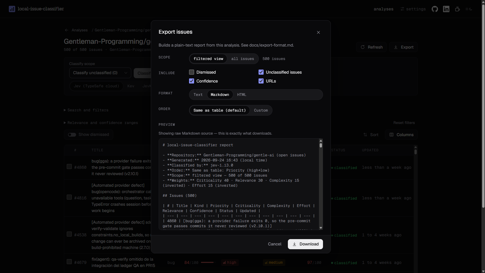

# Issue Classifier

[](LICENSE)
[](https://vuejs.org)
[](https://vite.dev)
[](https://www.typescriptlang.org)
[](https://pnpm.io)
[](https://vitest.dev)
[](package.json)
[](https://github.com/JeronimoRepetto/local-issue-classifier/actions/workflows/ci.yml)

**Try it: <https://issueclassifier.com>** — no install, paste a public repository URL and a Jev key
to start. Everything below also runs locally with `pnpm dev`.

Local-first web app that pulls a GitHub repo's issues and README, then asks Jev (TypeSafe AI's
decision model) to rate each issue by complexity, criticality, effort and relevance. Filter,
dismiss, sort by weighted priority and export as Text, Markdown or HTML. Keys stay in memory;
results stay in your browser.

See the [v0.1.0 release](https://github.com/JeronimoRepetto/local-issue-classifier/releases/tag/v0.1.0)
for what shipped first; [`CONTRIBUTING.md`](CONTRIBUTING.md) covers how to propose a change.

## How it works

1. Paste a GitHub repository URL (or `owner/repo`) and pick a state: Open, Closed or All.
2. The app fetches the repository's issues, README and project metadata directly from the GitHub
   API, and saves them as a new **analysis** in this browser.
3. **Classify** sends the issue and a trimmed project summary to Jev. By default it batches every
   selected issue into as few requests as fit (one request when the limits allow it); "One request
   per issue" is available under Settings → Classifier → Advanced. Jev answers four narrow
   questions — Complexity, Criticality, Effort and Relevance — plus a fifth, speculative Kind
   (bug / feature / documentation / question / maintenance / other). See
   [`docs/batching.md`](docs/batching.md) for how batching fits issues into a request.
4. The table shows every issue with its scores. Filter, sort (including by a weighted
   **Priority** score), dismiss what you don't care about, and **Export** the current view as a
   Text, Markdown or HTML report.

All deterministic work — fetching, trimming, sorting, filtering and exporting — stays in code;
Jev only makes the four judgments. See [`docs/jev-questions.md`](docs/jev-questions.md) for what
each question asks and how its answer becomes a value.

## Screenshots






## Requirements

- Node.js 22.13 or newer
- pnpm 11
- A Jev API key (required to classify issues)
- A GitHub personal access token (optional — raises the GitHub API rate limit)

## Install

```bash
pnpm install
```

pnpm 11 ignores the `pnpm` field in `package.json` for build approvals and overrides; this repo
declares both instead in `pnpm-workspace.yaml` (`allowBuilds` as a YAML map, e.g.
`allowBuilds: { esbuild: true }`), which is what actually grants esbuild's native postinstall step.

## Run

```bash
pnpm dev
```

Serves the app at http://localhost:5200 (fixed port, `strictPort: true`). For a production-style
build:

```bash
pnpm build     # vue-tsc --noEmit && vite build
pnpm preview   # serves the build at http://localhost:5200
```

## First run

A new analysis needs, in order: **1 Keys → 2 Repository → 3 Classify**. A small checklist on
Home tracks this the first time and disappears once each step has happened once:

1. Open **Settings** and paste your Jev API key (and, optionally, a GitHub token).
2. On Home, click **New analysis** and paste a repository URL.
3. Open the analysis and click **Classify unclassified**.

## Getting a Jev API key

1. Sign in to the TypeSafe console and open the API keys dashboard at
   <https://console.typesafe.ai/keys>.
2. Create a key.
3. Paste it into Issue Classifier's Settings. It is kept in memory only: a reload or
   **Clear keys** forgets it, and it is never written to disk, `localStorage` or the export.

What the Jev docs do not cover: account sign-up, key scopes, key rotation, spending limits and
plans. For those, see <https://docs.typesafe.ai>. From the docs' Models page: Jev charges only input
tokens, at $0.042 per million (output is free), and the rate limits are 1 200 requests per minute
and 250 000 tokens per second, which TypeSafe says may change without notice. A typical run of 200
issues costs roughly $0.03–0.06.

## Getting a GitHub token

A token is optional. Without one, public repositories load at 60 requests/hour and comments are skipped by default. With one, the limit is 5 000 requests/hour.

1. On GitHub, open **Settings → Developer settings → Personal access tokens → Fine-grained tokens → Generate new token**.
2. Name it (for example `Issue Classifier`), pick a short **expiration**, and pick the **resource owner** that owns the repositories.
3. Under **Repository access**, choose **Public repositories** (read-only) or **Only select repositories** for the private repos you want to analyse.
4. Under **Permissions → Repository permissions**, set:
   - **Issues: Read-only**, for issues and their comments;
   - **Contents: Read-only**, for the README, CONTRIBUTING, `docs/` and the package manifest;
   - **Metadata: Read-only**, for repository info. Confirm it shows Read-only; GitHub normally adds it automatically.
5. Generate the token and paste it into Settings. It is kept in memory only, so you paste it again after every reload; keep it in your own password manager if you want.

Classic tokens also work, but private repos need the `repo` scope, which also grants write access. Prefer the fine-grained token.

## Development

```bash
pnpm test        # vitest run
pnpm test:watch  # vitest watch mode
pnpm typecheck   # vue-tsc -p tsconfig.json && tsc -p tsconfig.node.json
pnpm hygiene     # public-repo hygiene checks (secrets, personal data, stray assets)
pnpm build:check # builds, then asserts the Cloudflare Pages dist/ tree has what it needs and ships nothing it must not
```

`pnpm icons` regenerates the icon components from `design/icons/`. `pnpm favicons` and
`pnpm og-image` regenerate the committed favicon PNGs and the Open Graph/Twitter card image from
their sources under `design/`; see [Link preview](docs/architecture.md#link-preview). The dev-only
component kit is at http://localhost:5200/?kit — it shows every component in both themes side by
side, with a switch to force reduced motion.

This project is developed with **strict TDD**: a test is written first and confirmed to fail for
the expected reason (RED), then the minimum implementation is added (GREEN), then refactored.
See [`CONTRIBUTING.md`](CONTRIBUTING.md) for the full convention and the architecture rules.

[`.github/workflows/ci.yml`](.github/workflows/ci.yml) runs `pnpm typecheck`, `pnpm test`,
`pnpm hygiene` and `pnpm build` on every push to `main` and every pull request.

## Keys

Issue Classifier uses two keys, both entered in **Settings**:

- **Jev API key** — required to classify issues. See
  [Getting a Jev API key](#getting-a-jev-api-key).
- **GitHub personal access token** — optional. It raises the GitHub rate limit from 60 to
  5 000 requests/hour and lets you fetch comments and private repositories. See
  [Getting a GitHub token](#getting-a-github-token).

Both are kept **in memory only**: they are never written to `localStorage`, `sessionStorage`,
cookies, or any other storage, and they vanish the moment the page reloads. Every page load
therefore starts from a "Keys required" state — you re-enter the keys, but your saved analyses
and preferences are still there and stay fully usable without them. **Clear keys** in Settings
wipes both immediately, and so does **Clear all local data**.

## Local data and privacy

Issue Classifier is local-only: everything below lives in this browser profile. Nothing is
ever sent anywhere except GitHub (`api.github.com`, for the repository you analyse) and, when you
classify issues, the local Jev proxy.

**What is stored, and where.** All of it is non-secret:

- **Saved analyses** live in the browser's **IndexedDB**, in a database named
  `local-issue-classifier`, one record per analysis: the repository's metadata and project context
  (README/CONTRIBUTING excerpts, manifest, `docs/` names), issue titles, trimmed bodies and a
  selection of comments, labels, authors and dates, any classifications, and your working state
  (filters, sort, dismissed issues). IndexedDB's quota is a share of your free disk space, far
  above `localStorage`'s ~5 MB; the meter on Home shows usage against the quota the browser
  reports.
- **Preferences** stay in `localStorage`, under keys prefixed with `local-issue-classifier:`: the
  last repository you entered, the last analysis you had open, and your defaults (max issues to
  load, max comments per issue, theme, and so on).
- **Older versions** kept analyses in `localStorage`. The first load after upgrading moves them
  into IndexedDB, checks each copy, then deletes the old entries, and says so once ("Moved N
  analyses to the larger local database"). Entries that could not be read are moved too and stay
  listed as unreadable, so you can delete them yourself.

**Eviction.** Browsers may clear a site's data when the disk runs low unless its storage is
marked persistent. The app asks for persistent storage (`navigator.storage.persist()`) once, on
the first save; **Settings → Local data** shows whether the browser granted it. If it did not,
export anything you need to keep.

**What is never stored.** Your Jev API key and GitHub token live only in memory for the current
tab. They are never written to `localStorage`, `sessionStorage`, cookies, IndexedDB, a URL, or
the export file — a reload or **Clear keys** in Settings loses them, by design (see "Keys" above).

**Deleting your data.**

- **Delete** on an analysis card (Home) removes just that one analysis and its entry in the list,
  after a confirmation.
- **Clear all local data**, at the bottom of Home (and in Settings → Local data), empties the
  IndexedDB database of saved analyses and removes every `local-issue-classifier:*`
  `localStorage` key (your preferences), after you type "delete" to confirm. It also clears your
  keys from memory. This cannot be undone.
- You can also wipe everything at once from your browser's own settings, under site data for
  `localhost:5200` (this covers both IndexedDB and `localStorage`).
- If saving ever fails because the browser's storage is full, the analysis stays open for that
  session and a notice offers **Retry save** — delete older analyses, or lower "Max issues to
  load" in preferences, then retry.

**Private repositories.** If you analyse a private repository, its issue text and README
excerpts are stored **in plain text, unencrypted**, in this browser profile until you delete
them. Anyone with access to your OS account or browser profile — or a browser extension allowed
on `localhost` — can read them. The New-analysis flow shows this note the first time you load a
private repository in a session; Settings repeats it permanently. Encryption at rest is out of
scope for v1 (see "Known limitations").

## Using saved analyses

**Home** lists every saved analysis as a card: its name, repository and state, when it was last
fetched, and its counts (total / classified / stale / dismissed) and approximate storage size.
Each card supports:

- **Open** (click the card) — reopens the analysis with its issues, classifications and working
  state (filters, sort, dismissed issues) exactly as you left them.
- **Rename** — an inline edit of the analysis name.
- **Refresh** — re-fetches the repository and merges the result:
  - new issues are added as unclassified;
  - changed issues (a different `updatedAt`) get their data replaced, and any existing
    classification is kept but marked **stale**;
  - unchanged issues are untouched;
  - issues no longer returned by GitHub (closed, transferred, deleted, or beyond the load cap)
    are kept with a **"No longer in source"** badge rather than deleted silently — you can
    restore them individually or remove them all at once with **Remove missing**;
  - your filters, sort, dismissed issues and export options are never touched by a refresh.
- **Delete** — removes that one analysis and its entry in the list, after a confirmation.

An **unreadable** entry (corrupt storage) can only be deleted.

Within an open analysis, **Dismiss** hides a row from the working table (with an undo toast); a
**Show dismissed** toggle brings dismissed rows back into view, and each still offers **Restore**.
**Clear all local data** on Home removes every saved analysis and your preferences at once (see
"Local data and privacy" above).

## Priority

Priority is an optional 0–100 ranking score, shown as its own table column and usable as a table
sort key and an export order key. It combines a row's four classification scores with four
adjustable weights — Criticality, Relevance, Complexity and Effort — into a single number; lower
complexity and lower effort push priority up, since an easy, low-effort fix is more attractive to
act on first.

Open the **Weights** popover (its trigger icon has a tooltip, "Adjust priority weights") next to
the Priority column header to adjust the four sliders (0–100, steps of 5, each with a numeric
input beside it, labeled with its current weight and share, e.g. "Criticality · 40 (40%)"). A live
example line shows what the current weights do to a real row's score. Changes preview live: the
Priority column and the row order update as you move a slider. **Reset to defaults** restores
40 / 30 / 15 / 15, and if every weight is set to 0 the column shows "—" and the popover says so —
there is nothing to rank on. Weights are saved per analysis and survive a reload.

Priority is a ranking aid, not a measurement: like relevance, it is built from the same ordinal
Jev scores (see [`docs/jev-questions.md`](docs/jev-questions.md#priority)).

## Export format

**Export…** opens a dialog to build a report of the current analysis (or a saved copy of its
filtered view) in one of three **Format**s — Text, Markdown (handy for pasting into an AI
conversation) or self-contained HTML (for viewing or sharing) — each carrying the model(s) that
produced the classifications, so two exports made with different models (e.g. Jev vs. Kev) can be
compared. You also choose:

- **Scope** — the current filtered view (default) or every issue in the analysis. Dismissed issues
  are always excluded unless you check **Include dismissed**.
- **Include unclassified issues**, **Include dismissed**, **Include confidence** and
  **Include URLs**.
- **Order** — an ordered list of sort keys and directions, edited the same way as the table's Sort
  popover (add, remove, reorder with Alt+↑/↓). **Use current table sort** copies the table's own
  order into the export in one click.

The format, order and options are saved per analysis. **Download** saves the previewed text as
`{owner}-{repo}-issues-{YYYYMMDD-HHmm}.{txt|md|html}` through an anchor-based download (no server
involved), with the matching MIME type. With nothing in scope, Download is disabled and the dialog
says "Nothing to export."

The full format for all three — every header line, the row layout, the Markdown table columns, the
HTML document shape, the Unclassified/Dismissed sections and a worked example — is specified in
[`docs/export-format.md`](docs/export-format.md).

## Local providers

By default the app classifies with **Jev on the TypeSafe cloud**, which needs a Jev API key. A
provider switch on the analysis view's classify bar also lets you pick Jev, a local server or the
in-browser model without opening Settings — see
[`docs/local-providers.md`](docs/local-providers.md#switching-from-the-analysis-view). In
Settings → **Classifier**, choose **Local server** for a copy-pasteable, step-by-step guide to
running Kev (`jaredpalmer/kev`), JevK5 (`allebee/jevk5`) or Laya (`NandhaKishorM/laya`) — or just
run `pnpm local:kev` from this repo, which clones, installs and starts Kev for you. A local server
costs nothing per token, keeps
issue text on your machine or LAN, and needs no key by default. See
[`docs/local-providers.md`](docs/local-providers.md) for the exact commands, the CORS/proxy
fallback and troubleshooting.

**In this browser (experimental).** A third choice runs a small model inside the page with
transformers.js on WebGPU (WebAssembly as a slow fallback): no install, no key, no server. The
weights (~579 MB) are downloaded once from the Hugging Face Hub and kept in the browser cache
(Settings → Local data shows the size and removes it). It runs one issue at a time and costs
nothing. For now the model is a generic Qwen3 0.6B, **not** Jev, so its answers are placeholders
until JevK5 weights are exported to ONNX. See [`docs/browser-inference.md`](docs/browser-inference.md).

## Hardware fit

Settings → **Hardware** answers "can this machine run a local model, and which size?" by reading
what the browser already exposes (WebGL/WebGPU renderer strings, device memory, CPU threads) —
nothing is benchmarked and nothing is sent anywhere. It gives a Fits/Tight/Won't fit verdict per
local model tier, a recommendation, and a manual GPU/VRAM override for when detection can't tell
(Firefox, Safari, or an unusual GPU). "Use Kev locally" applies the Kev preset to the provider
config in one click. See [`docs/hardware-fit.md`](docs/hardware-fit.md) for what is read, the GPU
table and the tier thresholds.

## Deployment modes

Locally, `pnpm dev`/`pnpm preview` run the app on `localhost:5200`; the Vite server proxies
`/jev/v1/...` to `https://api.typesafe.ai` (configurable through the server-only
`JEV_UPSTREAM_URL`), stripping `origin`, `referer` and `cookie`, logging and storing nothing — your
key passes through in transit only. GitHub is called directly from the browser in both modes.

Hosted, a static build plus a Cloudflare Pages Function (`functions/jev/[[path]].ts`) serves the
same `/jev` routes under the same same-origin policy. Switching between the two is configuration
only (`VITE_JEV_BASE_URL`, and for the hosted function, `ALLOWED_ORIGINS`). See
[`docs/architecture.md`](docs/architecture.md#deployment-modes) for the proxy contract and
environment variables.

## Deploy

The app is a static build plus a Pages Function; see docs/architecture.md for the deployment modes.

## Design

A modern, friendly interface with pixel art as its identity: the logo, icons, level glyphs and
empty states are pixel art, while all reading text (body, tables, numbers) uses Inter. The
design system lives in `src/ui/`:

- typed design tokens (`tokens.ts`) turned into CSS variables for the light and dark themes;
  the theme follows your system unless you pick one;
- WCAG 2.2 AA contrast, enforced by a test over every color pair in both themes;
- an 8 px spacing grid, square pixel frames and three elevation levels;
- short, purposeful motion that turns off under `prefers-reduced-motion`;
- a component kit (buttons, inputs, secret input, selects, slider, dialog, popover, tooltip,
  toasts, level and confidence badges, score bars, chips and empty states).

Run `pnpm dev` and open http://localhost:5200/?kit to see every component in both themes (the
kit page exists only in development). Tokens, components, motion rules and the icon pipeline
(`pnpm icons`) are documented in [`docs/design.md`](docs/design.md).

## Roadmap / backlog

Not implemented in v1; tracked as future work:

- **Pin-to-top** for individual issues, independent of sort.
- **Responsive filter collapse** below 1280 px — the filter bar does not yet collapse into a
  compact form at narrower widths (the table itself already scrolls within its container at
  1024 px, per the design-quality checklist).
- **Hosted deployment mode** (§9 mode b): a serverless proxy function for a public deployment,
  with its own review of abuse and rate limiting.

## Known limitations

- **Classification latency varies by mode.** Measured on 2026-09-24 with the TypeSafe cloud API:
  22 issues were classified in about 3.2 s in a single batched request (≈44k input tokens);
  per-issue mode took about 11 s for the same set. Accuracy of batched vs per-issue mode has not
  been measured yet (see [`docs/batching.md`](docs/batching.md) and [`scripts/compare-batching.mjs`](scripts/compare-batching.mjs)).
- **Browser CORS forces the local proxy.** The Jev API rejects browser origins outright, so every
  mode needs a proxy (`server/jevProxy.ts` in v1); there is no way to call Jev directly from the
  browser.
- **Local storage only, unencrypted.** There is no encryption at rest; see "Local data and
  privacy" above.
- **No automated cross-browser check.** Development and testing target current Chromium-based
  browsers; no manual Firefox or Safari pass has been recorded for this release.
- **v1 is local-only.** There is no hosted deployment yet (see "Roadmap / backlog").

## Credits

- **Fonts:** Geist Sans, Geist Mono and Geist Pixel, under the SIL Open Font License 1.1, bundled
  from `@fontsource` packages (no font CDN).
- **Icons:** all icons, the logo and illustrations are original pixel art made for this project
  (MIT). No Streamline icons are bundled; see [`docs/design.md`](docs/design.md#icon-source-decision-2026-09-23).

Full notices: [`THIRD_PARTY_NOTICES.md`](THIRD_PARTY_NOTICES.md).

## License

MIT — see [`LICENSE`](LICENSE). Third-party fonts and icons keep their own licenses; see
[`THIRD_PARTY_NOTICES.md`](THIRD_PARTY_NOTICES.md).

## Support the project

If Issue Classifier is useful to you, consider supporting its development on Ko-fi:

<a href="https://ko-fi.com/jeronimorepetto" target="_blank" rel="noopener noreferrer">
  
</a>

## Acknowledgements

- **[midudev](https://github.com/midudev) / [canirun.ai](https://github.com/midudev/canirun.ai)** — the visual direction and the
  browser-side hardware detection approach used by this app's "Hardware fit" panel were inspired
  by canirun.ai. 
- **TypeSafe AI** — makers of Jev, the decision model this app sends issues to for classification.
  See ["Getting a Jev API key"](#getting-a-jev-api-key).
- **[jaredpalmer/kev](https://github.com/jaredpalmer/kev)**,
  **[allebee/jevk5](https://github.com/allebee/jevk5)** and
  **[NandhaKishorM/laya](https://github.com/NandhaKishorM/laya)** — authors of the local,
  Jev-compatible servers this app can point to instead of the TypeSafe cloud. See
  ["Local providers"](#local-providers).
- **Vercel** — designers of the Geist typeface family (Geist Sans, Geist Mono, Geist Pixel) under
  the SIL Open Font License 1.1; see "Credits" above for the exact license text and how the fonts
  are bundled.

**Built with**

<a href="https://github.com/Gentleman-Programming/gentle-ai">
  
</a>
